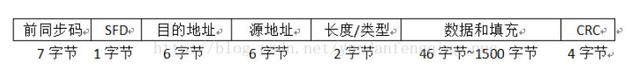
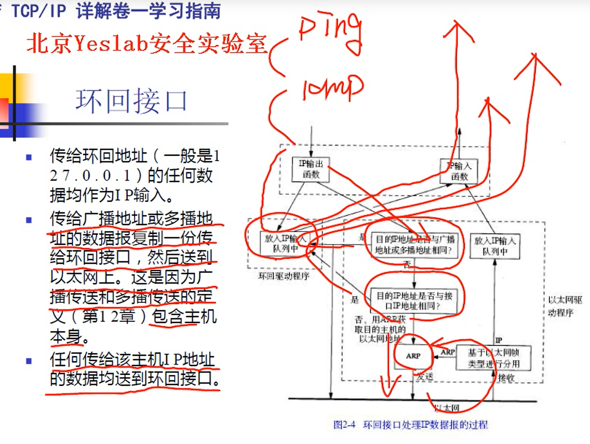
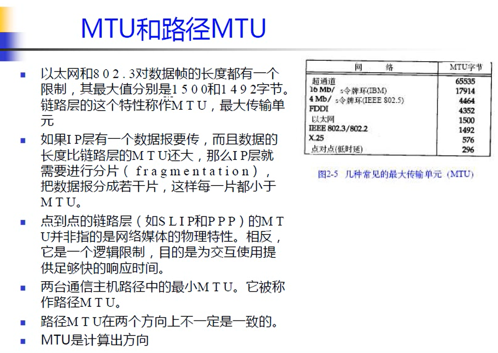

### 一、以太网协议介绍

**1、以太网协议简单介绍**

​	以太网是目前最流行的一种局域网组网技术（其他常见局域网组网技术还有令牌环局域网、无线局域网、ATM局域网），以太网技术的正式标准是IEEE 802.3标准。

​	使用以太网协议进行通信的实体间，必须通过某种介质直接相连。 通信介质可以是**真实的物理设备**，如网线、 [网卡](https://network.fasionchan.com/zh_CN/latest/protocols/ethernet.html#nic) 等； 也可以是通过虚拟化实现的**虚拟设备**。以太网协议在这类通信中，主要解决 [寻址](https://network.fasionchan.com/zh_CN/latest/protocols/data-link-layer.html#addressing) 以及 [复用/分用](https://network.fasionchan.com/zh_CN/latest/protocols/data-link-layer.html#multiplexing-demultiplexing) 两大问题。

**2、网卡**

​	现实世界中计算机通过网线连接到一起。每台通过网线连接的计算机都需要安装一个硬件设备——网卡（nic，network interface controller的缩写）。

​	从物理层面上来说，网卡负责把接收到的比特流转化为电信号发送出去；同时也接受不同的电信号，转化为比特流。

​	从软件层面上看，发送数据的时候，内核协议栈负责封装以太网帧（填充目的地址、源地址、类型和数据并计算校验和），同时调用网卡驱动程序进行发送。

​	接受数据时，负责验证目的地址、校验和并去除数据部分，交由上层协议栈进行处理。

​	每块网卡出厂时，预先分配了一个全球唯一的 [MAC地址](https://network.fasionchan.com/zh_CN/latest/protocols/ethernet.html#mac-address) ，并烧进硬件。 不管后来网卡身处何处，接入哪个网络， `MAC` 地址均不变。 当然，某些操作系统也允许修改网卡的 `MAC` 地址。

> **网卡混杂模式**：正常情况下，网卡忽略目的地址与自己不符的数据帧。 如果想要网卡接收所有数据帧，可以开启 **混杂模式** ：
>
> 
>
> 设置完成之后，网卡 `enp0s8` 带上 `PROMISC` 标志，代表混杂模式已经开启。
>
> 混杂模式开启后，网卡接收到的数据，不管目的地址是否是自己，都会提交驱动程序处理。 这在使用 [tcpdump](https://network.fasionchan.com/zh_CN/latest/toolkit/tcpdump.html) 等工具抓包分析网络数据时特别有用。

### 二、以太网数据帧结构

以太网数据帧大小： 60字节 到 1514字节

ip数据报大小： 46字节 到 1500字节

以太网的数据帧首部主要包括以下几个方面，下面逐一分析：

1、前同步码（7个字节）：实现物理层帧输入/输出同步和底层数据的正确阐述。

2、SFD（1个字节）：帧界定符，用来标识帧的开始。固定为10101011

3、目的地址和源地址：分别为6个字节，用于唯一标识某个主机（某个网卡物理地址MAC）。这6个字节在以太网中是按照从左到右的顺序发送的，同时对每个字节来说，最先发送的是最低位bit0，最后是最高位bit7。

​	在以太网帧中，目的地址可以分为三类：单播地址、多播地址和广播地址。单播地址通常与一个具体网卡的MAC地址相对应，它要求第一个字节的bit0（即最先发出去的位）必须是0；多播地址则要求第一个字节的bit0为1，这样，在网络中多播地址不会与任何网卡的MAC相同，多播数据可以被很多个网卡同时接收；广播地址的所有48位全为1（即FF-FF-FF-FF-FF-FF），同一局域网中的所有网卡可以接收广播数据包。

4、长度/类型：具有两种不同的意义，第一种表明该帧的数据是什么类型的数据，不同的协议的类型字段不同。如：0800H 表示数据为IP包，0806H 表示数据为ARP包，814CH是SNMP包,8137H为IPX/SPX包。（第二种情况是小于0600H的值是用于IEEE802的，表示数据包的长度。）

5、数据字段：该段数据不能超过1500字节。**因为以太网规定整个传输包的最大长度不能超过1514字节**。（14字节为DA，SA，TYPE）

6、PAD: 填充位。由于以太网帧传输的数据包最小不能小于60字节, 除去（DA，SA，TYPE 14字节），还必须传输46字节的数据，当数据段的数据不足46字节时，后面补000000.....(当然也可以补其它值)

7、CRC : 32位数据校验位.为32位的CRC校验,该校验由网卡自动计算,自动生成,自动校验,自动在数据段后面填入.对于数据的校验算法,我们无需了解.

​	事实上,PR,SD,PAD,FCS这几个数据段我们不用理它 ,它是由网卡自动产生的,我们要理的是DA,SA,TYPE,DATA四个段的内容.

​	所有数据位的传输由低位开始。

### 三、环回接口、MTU和路径MTU

**1、环回接口**

（1）发送给环回地址的ip数据报没有经过网卡，直接放入IP输入队列中，再递交给上一层。

（2）发送地址是广播地址或者是组播地址的，会直接发送一份给IP输入队列，然后再通过网卡发送到以太网上面。因为广播或者组播也包括主机本身。

（3）任何传给主机自身ip的数据都直接发给环回接口。

**2、MTU和路径MTU**

（1）MTU(maximum transmission unit , 最大传输单元 )

​	以太网对数据帧的长度有一个限制，不超过1500字节，如果加上以太网首部的话，不超过1514字节。

​	如果IP层有个数据报要传输，并且大于MTU的话，ip层就要进行分片，保证传输的每一个数据分片都小于MTU。

（2）路径MTU

​	两台主机进行通讯的时候，他们中间会经过很多路由器，每个路由器的出接口可能有各自的MTU，这个路径上面的最小MTU就是路径MTU。就是在这个路径传输数据报的时候，最大的不需要分片的传输数据长度。

### 四、参考文章

https://network.fasionchan.com/zh_CN/latest/protocols/ethernet.html

https://www.cnblogs.com/EasyData/archive/2009/01/05/1368812.html