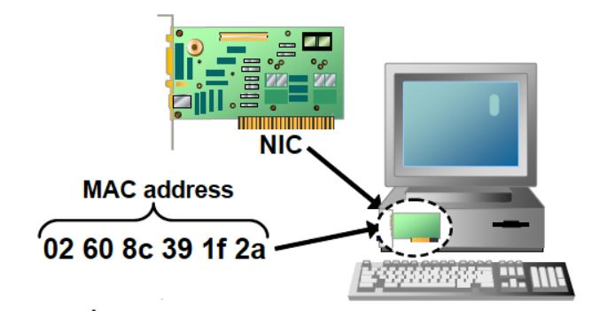
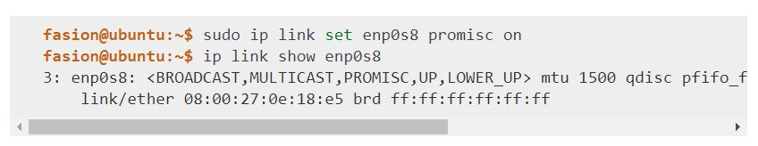

### 一、以太网协议介绍

**1、以太网协议简单介绍**

​	以太网是目前最流行的一种局域网组网技术（其他常见局域网组网技术还有令牌环局域网、无线局域网、ATM局域网），以太网技术的正式标准是IEEE 802.3标准。

​	使用以太网协议进行通信的实体间，必须通过某种介质直接相连。 通信介质可以是**真实的物理设备**，如网线、 [网卡](https://network.fasionchan.com/zh_CN/latest/protocols/ethernet.html#nic) 等； 也可以是通过虚拟化实现的**虚拟设备**。以太网协议在这类通信中，主要解决 [寻址](https://network.fasionchan.com/zh_CN/latest/protocols/data-link-layer.html#addressing) 以及 [复用/分用](https://network.fasionchan.com/zh_CN/latest/protocols/data-link-layer.html#multiplexing-demultiplexing) 两大问题。

**2、网卡**

​	现实世界中计算机通过网线连接到一起。每台通过网线连接的计算机都需要安装一个硬件设备——网卡（nic，network interface controller的缩写）。

​	从物理层面上来说，网卡负责把接收到的比特流转化为电信号发送出去；同时也接受不同的电信号，转化为比特流。

​	从软件层面上看，发送数据的时候，内核协议栈负责封装以太网帧（填充目的地址、源地址、类型和数据并计算校验和），同时调用网卡驱动程序进行发送。

​	接受数据时，负责验证目的地址、校验和并去除数据部分，交由上层协议栈进行处理。

​	每块网卡出厂时，预先分配了一个全球唯一的 [MAC地址](https://network.fasionchan.com/zh_CN/latest/protocols/ethernet.html#mac-address) ，并烧进硬件。 不管后来网卡身处何处，接入哪个网络， `MAC` 地址均不变。 当然，某些操作系统也允许修改网卡的 `MAC` 地址。

> **网卡混杂模式**：正常情况下，网卡忽略目的地址与自己不符的数据帧。 如果想要网卡接收所有数据帧，可以开启 **混杂模式** ：
>
> 
>
> 设置完成之后，网卡 `enp0s8` 带上 `PROMISC` 标志，代表混杂模式已经开启。
>
> 混杂模式开启后，网卡接收到的数据，不管目的地址是否是自己，都会提交驱动程序处理。 这在使用 [tcpdump](https://network.fasionchan.com/zh_CN/latest/toolkit/tcpdump.html) 等工具抓包分析网络数据时特别有用。

### 二、以太网数据帧结构

### 三、环回接口、MTU和路径MTU

### 四、参考文章

https://network.fasionchan.com/zh_CN/latest/protocols/ethernet.html

